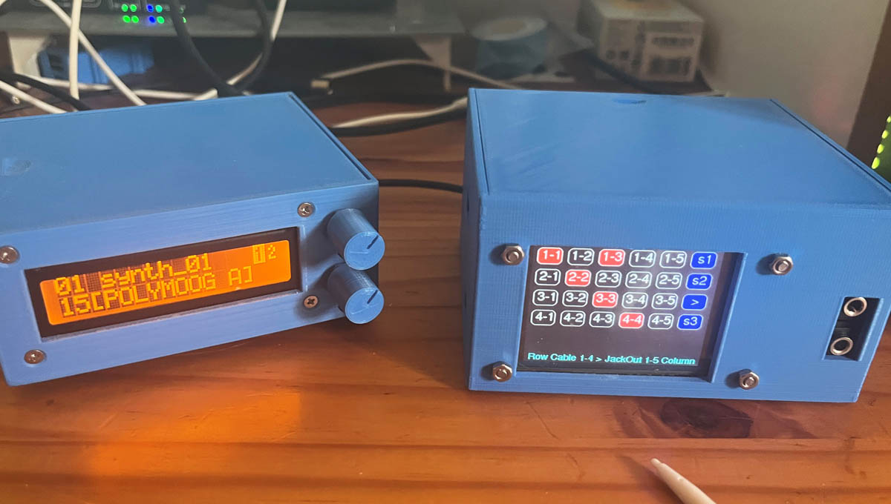
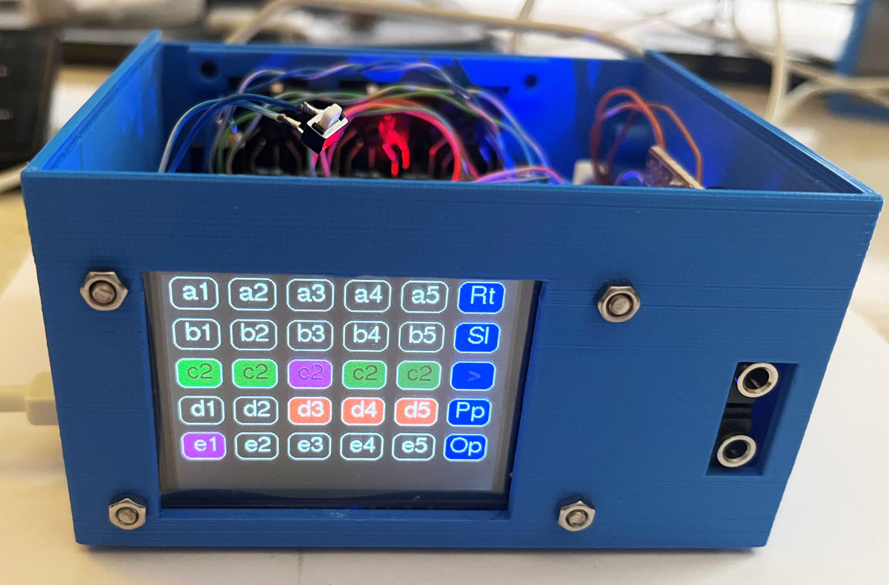
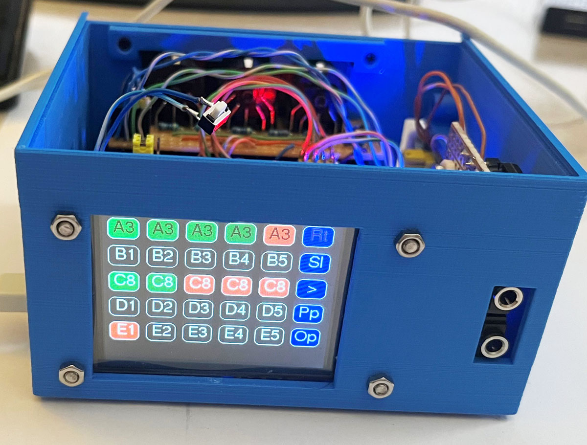
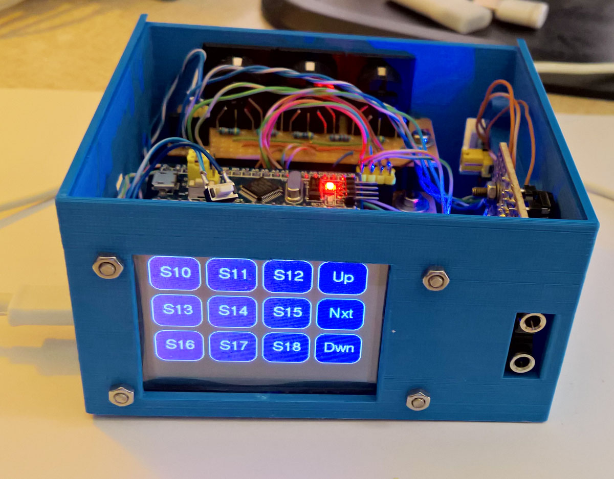
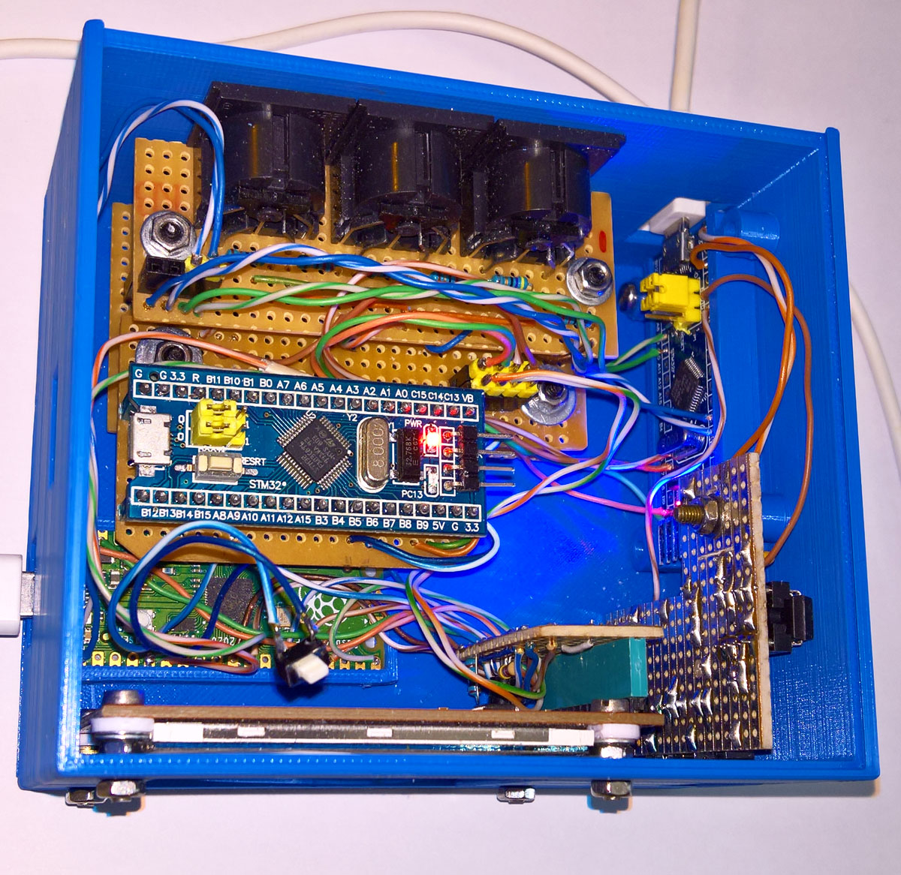
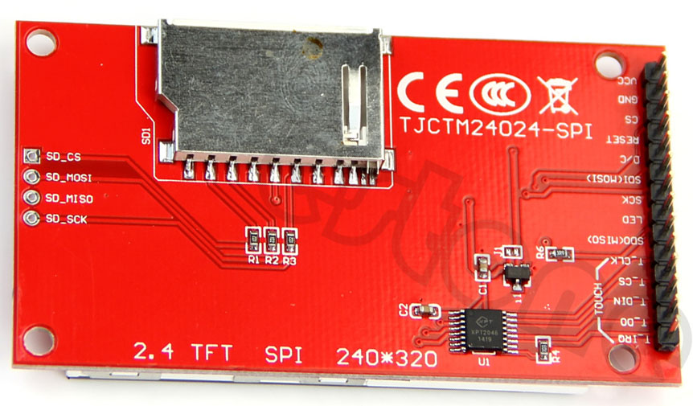
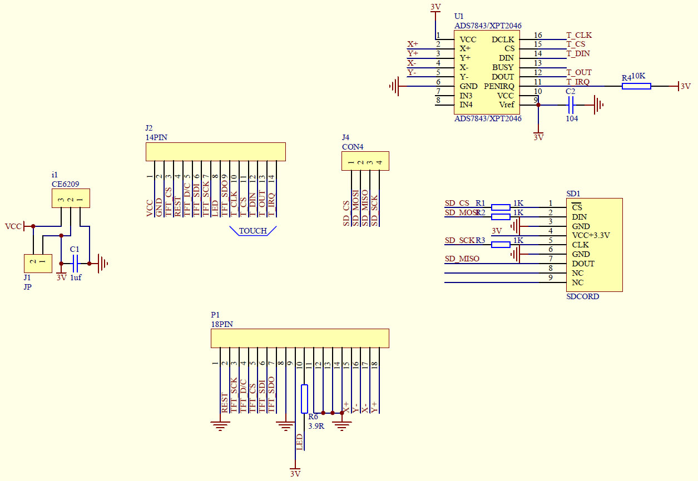
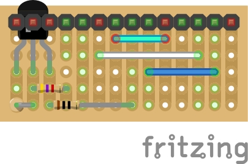

## STM32F103 Midi USB Interface based on Midiklik
This is a replacement for a 4x4 Xpoint Midi diode-based switch constructed in the early 1990's, by using a software Midi router and switch based on [**MidiKlik4x4**](https://github.com/TheKikGen/USBMidiKliK4x4/tree/master) - Midiklik is an unusual MidiUSB interface because of the extensive range and number of [**routing, filters and pipes**](https://github.com/TheKikGen/USBMidiKliK4x4/blob/master/UMK-4X4-SYSEX-IPL.TXT) and other configuration options, changeable via its set of internal SysEx commands.

**MidiKlik source code changes:**
```
(1) Addition of a four SysEx F0 77 77 78 E0 04,05,06,07 00 00 F7 to mod_intsysex.h
(2) Change all default routing to off (0) in  UsbMidiKliK4x4.ino except shift the cables one jackout position
(3) Update for the MidiKlik4x4 2024 changes to correct no USB Midi cable detect in freeze in the new UsbMidiKliK4x4.ino included here.
(4) //#pragma message(__VAR_NAME_VALUE(HARDWARE_TYPE)) in hardware_config.h 
(5) #define DEFAULT_ITHRU_USB_IDLE_TIME_PERIOD 1 in usbmidiklik4x4.h  
(6) #define USB_MIDI_PRODUCT_STRING "MidiKlik 5x" in usb_midi_device.h
```
The modified files are inside the folder PicoKlik29 as USBMidiKliK4x4.zip.

The Pico Midi Switch has 5 screens - two with a 5x5 matrix touch switch where rows are Input Jacks A-E, columns are Output Jacks 1-5 - for normal IThru routing and Midi routing (both also indicating attached slots). There is a third screen for setting Cable to Output Jack connections as a 4x5 matrix. The other two screens, each with 36 buttons on 4 layers A-D, are for Midi, configuration, and control functions such as rebooting the RP2040Pico or the STM32F103, or sending Midi control changes and system exclusive messages. Use the [Nxt] or [>] key to move between the four layouts, and the [Up] and [Dwn] to move between the 4 layers A to D. Note that the Pico updates its Midi routing data after switch-on, before the first LCD blank timeout - currently set to 25 seconds - the status bar will show "Sync completed" when  Midi routing data are valid. If the standalone mode is used - i.e. the usb cable is only used to provide power, press the [Re1] or [Re2] keys to resync after the initial idle-out period of 15 seconds. 

**XPoint Switch Colours:** Black indicates no routing connection between input Jack A-E and output Jack 1-5. Pressing on any of the 25 crosspoints will toggle it on/off, and the colour will change to Red when an Input-Output Jack-pair is connected. Green indicates that a Slot is attached to an input Jack and the second character on the switch button is then the slot number 1-8 instead of the output number 1-5. When the [Sl] button is active (i.e. Green), pressing any of the attached buttons in a row will toggle the slot on/off. The [Pp] and [Rt] button functions are explained in the comments of the source code file [**PicoKlik29.ino**](https://github.com/TobiasVanDyk/STM32F103-Midi-USB-Interface/blob/main/PicoKlik29/PicoKlik29.ino) - note that the three buttons [Rt], [Sl], and [Pp] are green when active and blue when not. Combinations of these three buttons are also used to for example set/unset a Pipe Bypass.

To change or add/remove slots to an iThru or Midi input Jack, press the [Sl] key - it will change colour. The status bar will show a list of all attached slots. Pressing any existing slot rows will toggle it on/off without changing the slot number. Pressing the [Op] option button will cycle between 1 and 8, and pressing any input Jack row A-E will then assign the specified slot to the input Jack. Once the iThru mode is active it either requires pressing key [S03] - reboot MidiKlik4x4, or preferably just resync the Pico by pressing the [Re2] key, to show the current the Midi routing matrix switches. 

It uses a Raspberry Pi Pico RP2040, and a 2.4" ILI9341 touchLCD, and two STM32F103 boards. The Pico controls the Midi switches via UART Port 1. It is therefore possible to use just the Pico controller in an external case, and connect it to an existing (re-programmed), multi-MidiKlik4x4 through its Jack Port 1.

<p align="left">
 
 
</p>

<p align="left">
 
  
 
 
</p>

The 3D case files are in the STL folder. The two Pico and BluePill MCU holders are based on this [**PCB-holder SCAD model**](https://www.thingiverse.com/thing:4061855). Various length and width parameters for other MCU-boards (namely an RP2040 Pico, STM32F103 Blue Pill, STM32F411 Black Pill, and a Teensy 4.1) are in the file pcbholder-params.txt, also in the STL folder.

<p align="left">
 
  
</p>

The LCD is an Electrodragon LCD ILI9341 320x240 2.4inch with XPT2046 touch control. An external transistor was added to control the display brightness as shown below.

<p align="left">
 
 
 
</p>

6N137 Midi Input and direct Midi Output

<p align="left">
 
  
</p>

### Programming Guide

This is a detailed description of how to compile and program an STM32F103C8T6 MidiUSBConverter with the code from [**TheKikGen USBMidiKliK4x4**](https://github.com/TheKikGen/USBMidiKliK4x4) without having to touch the Boot jumpers on the STM32F103 board.

01 Install the STM32CubeProgrammer from [**here**](https://www.st.com/en/development-tools/stm32cubeprog.html)  - you will have to supply an email to do so. You may want to inspect your sound devices and com ports present before the next steps. If necessary install [**MidiOX**](http://www.midiox.com/) for more detailed information about your sound midi and synth devices.
 
02 Connect the STM32F103 board to an ST-Link programmer and plug the ST-Link into a USB port.
 
03 Open the STM32CubeProgrammer and click connect.
 
04 Download the bootloader file named tkg_hid_generic_pc13.bin from [**this releases page**](https://github.com/TheKikGen/USBMidiKliK4x4/releases/tag/v2.5.1). <br>
Then click the CubeProgrammer green down-arrow on the left and then click Open file and select the hid bootloader file: tkg_hid_generic_pc13.bin
 
05 Click Start Programming and then click OK twice. Then click Disconnect and then close the STM32CubeProgrammer.

<p align="left">
 
  
</p>

06 Disconnect the ST-Link from the USB port and then disconnect it from the STM32F103 board.

07 Plug the STM32F103 board into a USB port.

08 Install [**Arduino 1.8.19**](https://www.arduino.cc/en/software). 

09 Download the [**MidiUSB4x4 repository**](https://github.com/TheKikGen/USBMidiKliK4x4) as a zip file and unzip it underneath your My Documents/Arduino/ folder. Rename the folder as UsbMidiKliK4x4 and you can then delete the bin and doc folders, and the .gitignore and README.md files. Replace three of the original files with the ones I have edited (usb_midi_device.h, hardware_config.h, UsbMidiKliK4x4.ino) - or do your own editing on the original files. 

10 Download the two repositories [**midiXparser**](https://github.com/TheKikGen/midiXparser) and [**Pulseout**](https://github.com/TheKikGen/PulseOut) as zip files, and extract them underneath your My Documents/Arduino/libraries/ folder as midiXparser and Pulseout folders. Double click on UsbMidiKliK4x4.ino to open the Arduino IDE.

11 Install the Arduino SAM boards (Cortex-M3) board as explained [**here**](https://github.com/TheKikGen/USBMidiKliK4x4/wiki/Build-UsbMidiKlik4x4-from-sources) and [**here**](https://github.com/rogerclarkmelbourne/Arduino_STM32/wiki/Installation). Click [Install] and [Close].

<p align="left">
 
</p>
 
12 Download zip file containing STM32 files from [**here**](https://github.com/rogerclarkmelbourne/Arduino_STM32/archive/refs/heads/master.zip). Make a folder named hardware underneath My Documents/Arduino/ and extract the Arduino_STM32 zip file there. This will add the libmaple (modified) libraries originally from [**Leaflab Maple**](https://github.com/leaflabs/libmaple), which is used by the MidiUSB application as shown below.

<p align="left">
 
</p>
 
13 Select your board as a Generic STM32F103C series as board type and as an STM32F103C8 (20k RAM.64k Flash) as variant - see below.
 
Also in the Tool menu select:<br>
* "Faster -O2" as optimize option
* "72 Mhz" as CPU speed
* "HID bootloader" as upload method 

14 Press Compile then press the reset button on the board twice and then press upload. 

<p align="left">
 
  
</p>

15 Close the Arduino IDE and press the reset button on the board once.
 
16 Check that a new sound device named Midiklik 4x is present. 

<p align="left">
 
</p>


