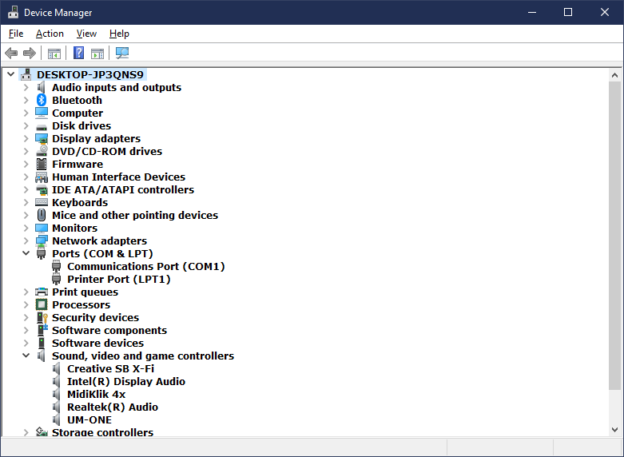

## STM32F103 Midi USB Interface based on Midiklik

This is a detailed description of how to compile and program an STM32F103C8T6 MidiUSBConverter with the code from [**TheKikGen USBMidiKliK4x4**](https://github.com/TheKikGen/USBMidiKliK4x4) as the instructions there are aimed at current users of the device, rather than a new user. 

**Midiklik 4x is an unusual MidiUSB interface because of the extensive number of options changeable via sysex commands.** In the future it will replace an analog 4x4 Midi Crosspoint switch which was built in the early 1990's - probably with the addition of a touch LCD control surface.

 

1. Install [**Arduino 1.8.19**](https://www.arduino.cc/en/software). To upload through STLink SWD, Serial or DFU, [**STM32CubeProgrammer**](https://www.st.com/en/development-tools/stm32cubeprog.html) also has to be installed.

2. Download the [**MidiUSB4x4 repository**](https://github.com/TheKikGen/USBMidiKliK4x4) as a zip file and unzip it underneath your My Documents/Arduino/ folder. Rename the folder as UsbMidiKliK4x4 and you can then delete the bin and doc folders, and the .gitignore and README.md files. Replace three of the original files with the ones I have edited (usb_midi_device.h, hardware_config.h, UsbMidiKliK4x4.ino) - or do your own editing on the original files. 

3. Download the two repositories [**midiXparser**](https://github.com/TheKikGen/midiXparser) and [**Pulseout**](https://github.com/TheKikGen/PulseOut) as zip files, and extract them underneath your My Documents/Arduino/libraries/ folder as midiXparser and Pulseout folders. Double click on UsbMidiKliK4x4.ino to open the Arduino IDE.

4. Install the Arduino SAM boards (Cortex-M3) board as explained [**here**](https://github.com/TheKikGen/USBMidiKliK4x4/wiki/Build-UsbMidiKlik4x4-from-sources) and [**here**](https://github.com/rogerclarkmelbourne/Arduino_STM32/wiki/Installation). Click [Install] and [Close].

 

 
5. Download zip file containing STM32 files from [**here**](https://github.com/rogerclarkmelbourne/Arduino_STM32/archive/refs/heads/master.zip). Make a folder named hardware underneath My Documents/Arduino/ and extract the Arduino_STM32 zip file there. This will add the libmaple (modified) libraries originally from [**Leaflab Maple**](https://github.com/leaflabs/libmaple), which is used by the MidiUSB application as shown below.

 

 
Select your board as a Generic STM32F103C series as board type and as an STM32F103C8 (20k RAM.64k Flash) as variant - see below.
 

 

Also in the Tool menu select: 
* "Faster -O2" as optimize option
* "72 Mhz" as CPU speed
* "STLink" as upload method 

 

6. Connect the STM32F103 to the STLink adapter (4 wires), and connect only the STLink to the computer USB. Check that both boot0 and boot1 jumper selections are on 0. Click Compile on the Arduino IDE and then Upload. The application is now on the Blue Pill but it still needs a program compatible HID bootloader installed.

7. Download the [**HID bootloader repository**](https://github.com/TheKikGen/stm32-tkg-hid-bootloader/tree/master/tools/tkg_hid_btl_uploader) and extract it as folder tkg_hid_btl_uploader underneath your My Documents/Arduino/ folder. Doubleclick on the tkg_hid_btl_uploader.ino file and comment out #define GENERIC_PC13.

 

 
Click Compile on the Arduino IDE and then Upload. This should then upload the HID bootloader to the blue Pill still connected via the STLink adapter.

8. Close all Arduino windows and remove the STLInk from the Blue Pill. Plug it into the PC USB Port and check that a new sound device named Midiklik 4x is present. If not, try to install the bootloader differently, as in the next section by using a USB serial UART.

 

 
9. Download and install the [**STM32 Flash loader**](https://www.st.com/en/development-tools/flasher-stm32.html).

Also download the bootloader bin tkg_hid_generic_pc13.bin from [**this releases page**](https://github.com/TheKikGen/USBMidiKliK4x4/releases/tag/v2.5.1). 

Connect your sTM32F103 to a USB-Serial converter using only the V+ (5v or 3v3 but do connect it then to the right corresponding pins on the Blue Pill as well), Ground and Tx-Rx and Rx-Tx. Check that boot0 and boot1 jumper selections are on 1 and 0 respectively. Then run the Flash loader and select the ComXX port for the USBSerial converter and then follow the setup as below - but select the **tkg_hid_generic_pc13.bin** file.

  
 

10. Check that both boot0 and boot1 jumpers are on 0. Plug your Blue Pill it into the PC USB Port and check that a new sound device named Midiklik 4x is present. You may want to install [**MidiOx**](http://www.midiox.com/) to check that all four input and four output Midi ports are available.

 

 

