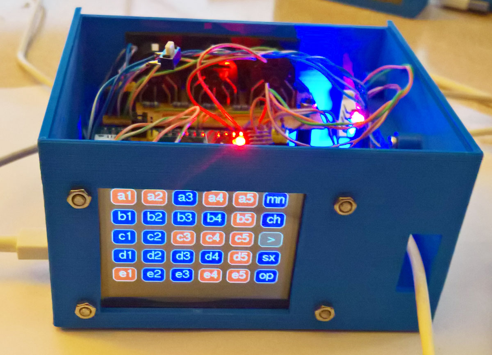
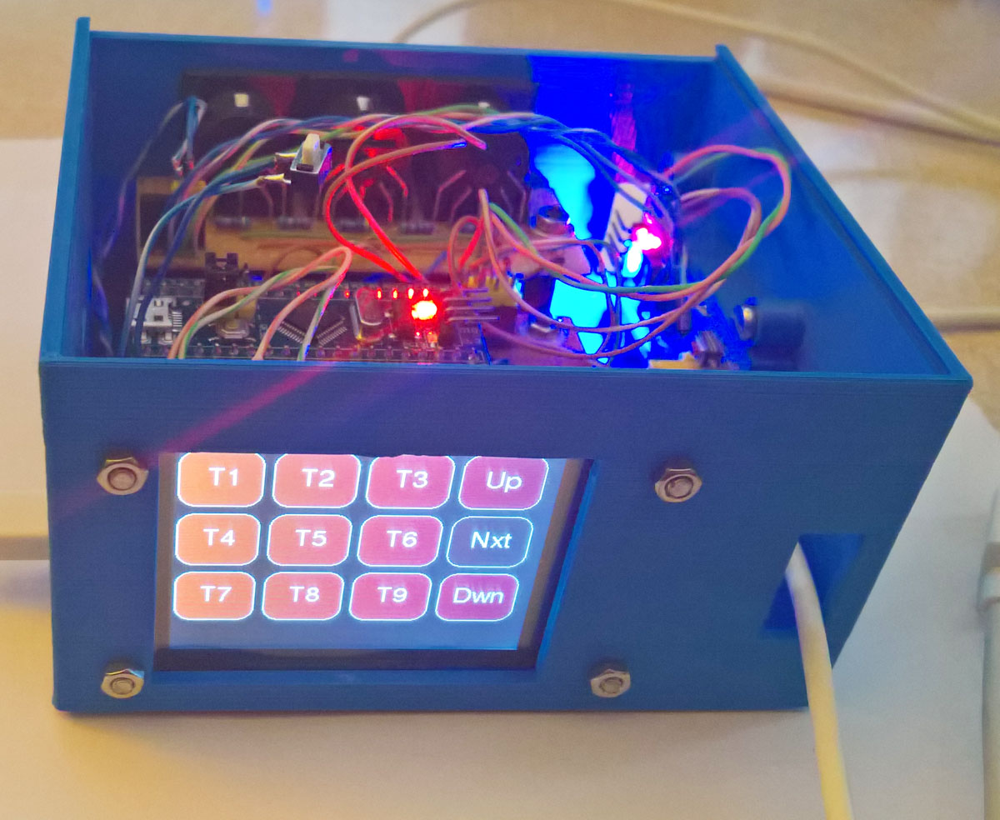
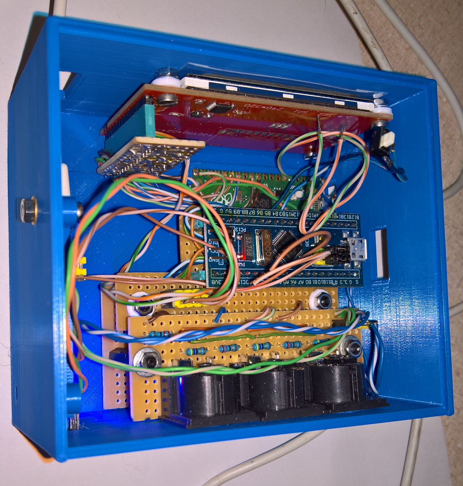
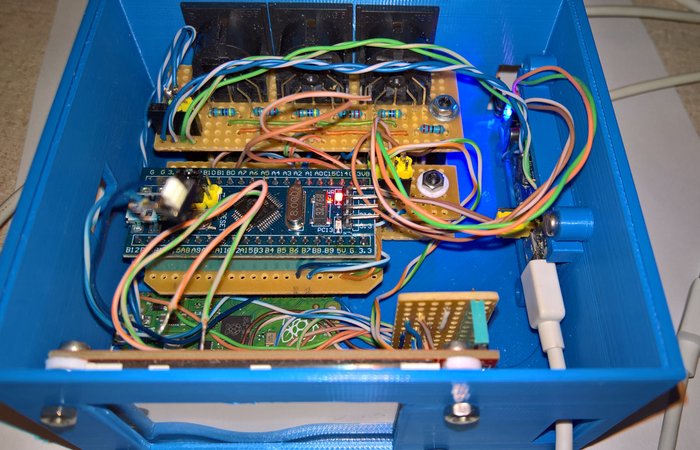

## STM32F103 Midi USB Interface based on Midiklik
This is a replacement for a 4x4 Xpoint Midi diode-based switch using a software Midi switch based on [**MidiKlik4x4**](https://github.com/TheKikGen/USBMidiKliK4x4/tree/master) - Midiklik is an unusual MidiUSB interface because of the extensive range and number of routing, filter and other configuration options, changeable via its set of internal SysEx commands. 

The Pico Midi Switch has 4 screens - two with a 5x5 matrix touch switch for normal Midi routing and IThru routing, and two screens with 12 buttons for various functions - all of which are still in development. Use the [Nxt] or [>] key to move between the four layouts. Note that the Pico updates its Midi routing data after switch-on, during the first LCD blank timeout - currently set to 20 seconds - i.e. Midi routing data will only be valid after this first LCD timeout. 

It uses a Raspberry Pi Pico RP2040, and a 2.4" ILI9341 touchLCD, and two STM32F103 boards. The Pico controls the Midi switches via UART Port 1. The only change is the addition of a SysEx F0 77 77 78 E0 04 00 00 F7 to mod_intsysex.h to send routing data to the Pico - the modified file is here as mod_intsysex.zip

 
 
 
 

 
  

The LCD is an Electrodragon LCD ILI9341 320x240 2.4inch with XPT2046 touch control. An external transistor was added to control the display brightness as shown below.

 
 
 

This is a detailed description of how to compile and program an STM32F103C8T6 MidiUSBConverter with the code from [**TheKikGen USBMidiKliK4x4**](https://github.com/TheKikGen/USBMidiKliK4x4) without having to touch the Boot jumpers on the STM32F103 board.

01 Install the STM32CubeProgrammer from [**here**](https://www.st.com/en/development-tools/stm32cubeprog.html)  - you will have to supply an email to do so. You may want to inspect your sound devices and com ports present before the next steps. If necessary install [**MidiOX**](http://www.midiox.com/) for more detailed information about your sound midi and synth devices.
 
02 Connect the STM32F103 board to an ST-Link programmer and plug the ST-Link into a USB port.
 
03 Open the STM32CubeProgrammer and click connect.
 
04 Download the bootloader file named tkg_hid_generic_pc13.bin from [**this releases page**](https://github.com/TheKikGen/USBMidiKliK4x4/releases/tag/v2.5.1).  
Then click the CubeProgrammer green down-arrow on the left and then click Open file and select the hid bootloader file: tkg_hid_generic_pc13.bin
 
05 Click Start Programming and then click OK twice. Then click Disconnect and then close the STM32CubeProgrammer.

 
  

06 Disconnect the ST-Link from the USB port and then disconnect it from the STM32F103 board.

07 Plug the STM32F103 board into a USB port.

08 Install [**Arduino 1.8.19**](https://www.arduino.cc/en/software). 

09 Download the [**MidiUSB4x4 repository**](https://github.com/TheKikGen/USBMidiKliK4x4) as a zip file and unzip it underneath your My Documents/Arduino/ folder. Rename the folder as UsbMidiKliK4x4 and you can then delete the bin and doc folders, and the .gitignore and README.md files. Replace three of the original files with the ones I have edited (usb_midi_device.h, hardware_config.h, UsbMidiKliK4x4.ino) - or do your own editing on the original files. 

10 Download the two repositories [**midiXparser**](https://github.com/TheKikGen/midiXparser) and [**Pulseout**](https://github.com/TheKikGen/PulseOut) as zip files, and extract them underneath your My Documents/Arduino/libraries/ folder as midiXparser and Pulseout folders. Double click on UsbMidiKliK4x4.ino to open the Arduino IDE.

11 Install the Arduino SAM boards (Cortex-M3) board as explained [**here**](https://github.com/TheKikGen/USBMidiKliK4x4/wiki/Build-UsbMidiKlik4x4-from-sources) and [**here**](https://github.com/rogerclarkmelbourne/Arduino_STM32/wiki/Installation). Click [Install] and [Close].

 

 
12 Download zip file containing STM32 files from [**here**](https://github.com/rogerclarkmelbourne/Arduino_STM32/archive/refs/heads/master.zip). Make a folder named hardware underneath My Documents/Arduino/ and extract the Arduino_STM32 zip file there. This will add the libmaple (modified) libraries originally from [**Leaflab Maple**](https://github.com/leaflabs/libmaple), which is used by the MidiUSB application as shown below.

 

 
13 Select your board as a Generic STM32F103C series as board type and as an STM32F103C8 (20k RAM.64k Flash) as variant - see below.
 
Also in the Tool menu select: 
* "Faster -O2" as optimize option
* "72 Mhz" as CPU speed
* "HID bootloader" as upload method 

14 Press Compile then press the reset button on the board twice and then press upload. 

 
  

15 Close the Arduino IDE and press the reset button on the board once.
 
16 Check that a new sound device named Midiklik 4x is present. 

 

### Prototype

6N137 Midi Input and direct Midi Output

 
  

